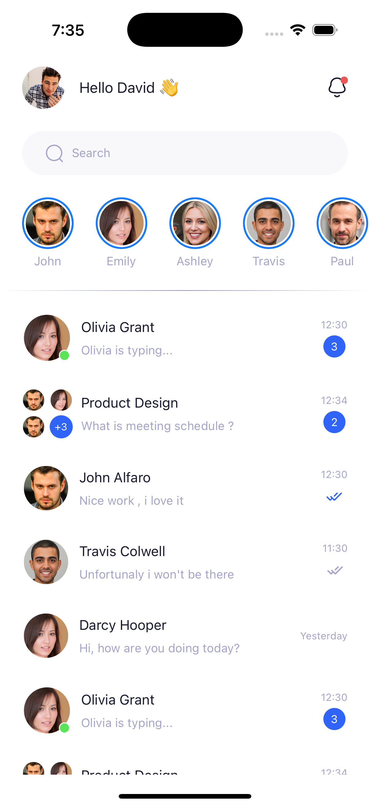

## React Native Single Screen Page UIS

<p> Aim of this repository is to design single screen page UIS with React Native.</p>

## Purpose

- Purpose of making this repository is to learn how to make or write ui screen codes in
  React Native.
- It also focus on the clean and reusable codes.

## Packages

- `components`: Includes all the common components here , which can used in any screen for eg -
  Text , Hstack , Vstack etc....
- `screen`: For including any UI.

## How to Contribute

- If you have any single page complex screen UI , you are most welcome.
- **Note** :- Before start contributing , please check the remaining screens for code quality
  and `components` package for the common components.

## 🖥️ Screenshots

### Chat UI

<table style="width:100%">
  <tr>
    <th>Android</th>
<th>iOS</th>
  </tr>
  <tr>
    <td></td>
 <td></td>
  </tr>
</table>

## Find this project useful ? ❤️

- Support it by clicking the ⭐️ button on the upper right of this page. ✌️

# License

```markdown
Copyright 2025 Jayant Kumar

Licensed under the Apache License, Version 2.0 (the "License");
you may not use this file except in compliance with the License.
You may obtain a copy of the License at

http://www.apache.org/licenses/LICENSE-2.0

Unless required by applicable law or agreed to in writing, software
distributed under the License is distributed on an "AS IS" BASIS,
WITHOUT WARRANTIES OR CONDITIONS OF ANY KIND, either express or implied.
See the License for the specific language governing permissions and
limitations under the License.
```
